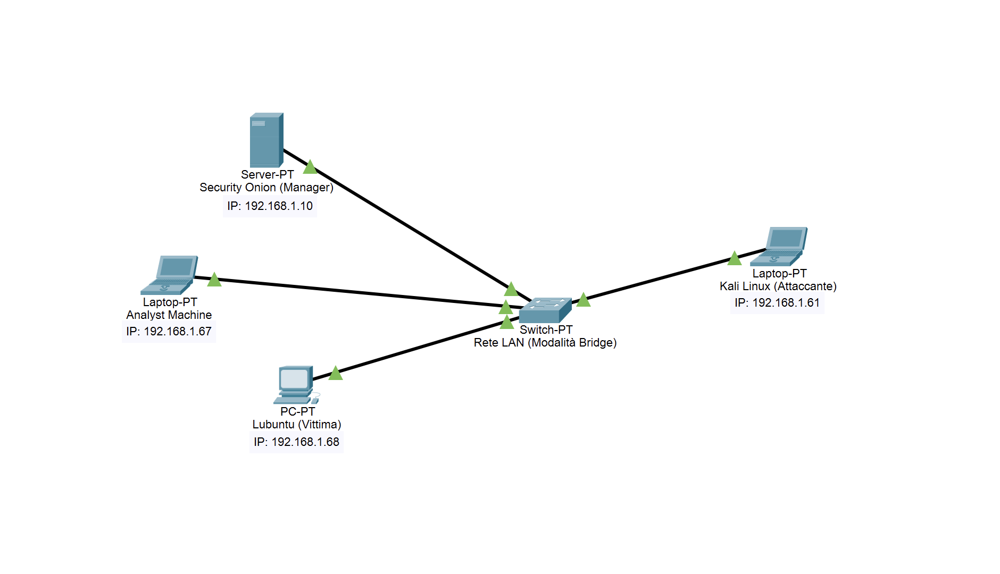
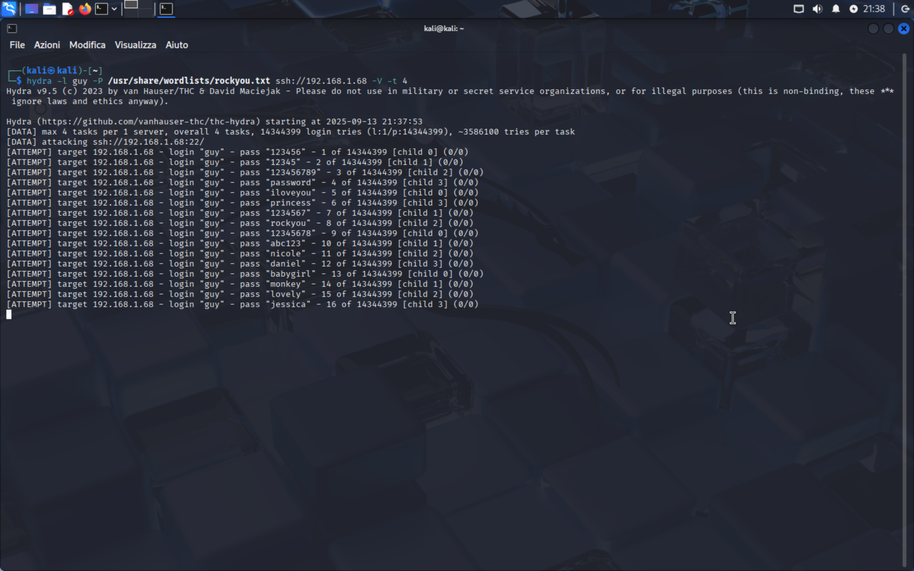
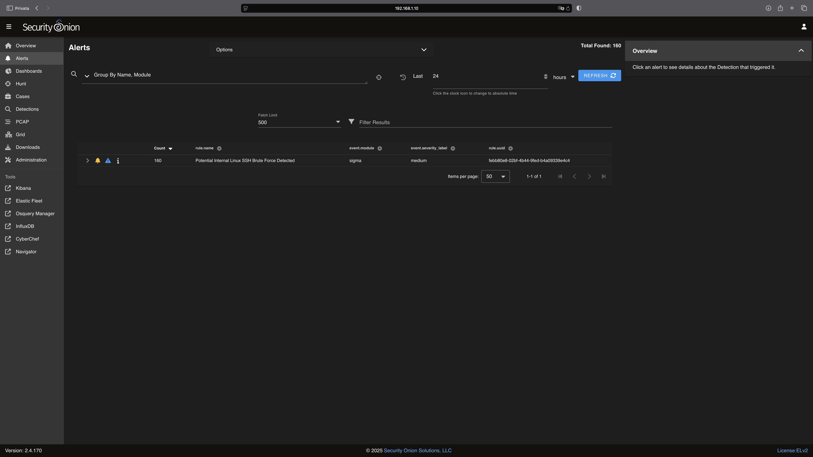

# Rilevamento di un Attacco Brute-Force SSH: Un Progetto di Sicurezza Offensiva e Difensiva

## Introduzione

Questo progetto documenta il processo di allestimento di un ambiente di laboratorio per testare la capacità di rilevare e tracciare un attacco di tipo **brute-force SSH**. L'obiettivo è dimostrare una pipeline di sicurezza end-to-end, dalla generazione dell'attacco alla raccolta dei log, fino alla creazione di una regola di rilevamento e alla gestione degli alert.

Abbiamo utilizzato una combinazione di strumenti di sicurezza open-source per simulare un attacco e monitorare le attività, evidenziando l'importanza di un'architettura di sicurezza ben configurata per contrastare le minacce più comuni.

## Architettura del Laboratorio

Per il test, abbiamo costruito un ambiente di rete simulato utilizzando **VMware Fusion** come tool di virtualizzazione. A causa di limitazioni di risorse hardware che non ci permettevano di far girare tutti e tre i sistemi operativi su un unico host, abbiamo dovuto distribuire le macchine virtuali su due computer separati collegati tramite la stessa rete LAN in modalità "Bridge".

* **SOC (Security Operations Center):** **Security Onion** è stato configurato per agire come sistema di monitoraggio centrale.
* **Target (Vittima):** Una macchina **Lubuntu** è stata utilizzata come bersaglio, con il servizio SSH attivo e un **Elastic Agent** installato per la raccolta dei log.
* **Attaccante:** Una macchina **Kali Linux** è stata usata per lanciare la simulazione dell'attacco.

Questa configurazione ci ha permesso di simulare uno scenario realistico e di testare la nostra capacità di rilevare attività sospette, nonostante le sfide logistiche iniziali.

<div align="center">
  
</div>

-----

## Esecuzione e Rilevamento

Il test è stato eseguito lanciando una simulazione di attacco **brute-force** contro l'account locale chiamato `guy` sul target Lubuntu. Ho scelto questo nome come riferimento a Guy Fawkes, una figura iconica nella storia e spesso associata al mondo dell'hacking e della cybersecurity. Lo strumento utilizzato per questa fase è stato **Hydra**.

```bash
# Esempio di comando Hydra
hydra -l guy -P /usr/share/wordlists/rockyou.txt ssh://192.168.1.68 -V -t 4
```

  * `-l guy`: Specifica l'utente target.
  * `-P /usr/share/wordlists/rockyou.txt`: Utilizza un dizionario di password come il famoso `rockyou.txt` per tentare di indovinare la password.
  * `ssh://192.168.1.68`: Indica il protocollo e l'indirizzo IP della macchina vittima.
  * `-V`: Mostra i tentativi di login e l'avanzamento in tempo reale (modalità verbose).
  * `-t 4`: Limita il numero di tentativi simultanei.

<div align="center">
  
</div>

I tentativi di login falliti venivano registrati in tempo reale nel log `/var/log/auth.log` sulla macchina Lubuntu. L'Elastic Agent ha poi inviato questi log al SOC di Security Onion.

-----

## Gestione delle Sfide

Una delle principali sfide iniziali è stata la **mancanza di visibilità degli alert** su Security Onion durante le prime fasi dell'attacco. Per risolvere il problema, abbiamo condotto una serie di verifiche diagnostiche su Kali e Lubuntu. Abbiamo controllato i log di autenticazione (`auth.log`) e verificato se l'Elastic Agent inviasse i dati.

I controlli hanno confermato che la configurazione era corretta e che il problema risiedeva altrove. Abbiamo notato, inoltre, un avviso di "Possible Kali Linux hostname in DHCP Request Packet" su Security Onion, il che ci ha suggerito che il nostro problema doveva risiedere nella configurazione delle regole. In un tentativo, abbiamo scoperto che le regole predefinite su Kibana non erano state scaricate, quindi abbiamo attivato quelle che ci servivano.

A questo punto, gli alert venivano generati correttamente in Kibana, ma non apparivano su Security Onion. Questo ci ha portato a dedurre che non ci fosse una comunicazione completa tra i due strumenti. La vera soluzione è stata la creazione di una **Sigma rule** personalizzata, basata sulla regola di Elastic `Potential Internal Linux SSH Brute Force Detected`. Questo ha finalmente permesso a Security Onion di visualizzare l'alert.

<div align="center">
  
</div>

-----

## Conclusioni e Lezioni Apprese

Il progetto ha dimostrato con successo una **pipeline di rilevamento funzionante**: gli eventi di login falliti sono stati registrati, raccolti e hanno generato alert visibili su Security Onion grazie alla Sigma rule creata appositamente.

Questo studio ci ha permesso di apprendere diverse lezioni fondamentali:

* **La configurazione di un SIEM richiede tempo e attenzione**. La sua efficacia dipende dall'abilitazione e dall'ottimizzazione di regole efficienti per prevenire la "alert fatigue".
* La **conversione tra formati di regole** (come da EQL a Sigma) può essere complessa, ma è un'abilità cruciale per gli analisti di sicurezza.
* Il continuo studio e la pratica sono essenziali per rimanere al passo con le minacce in continua evoluzione della cybersecurity. Questo progetto è stato un importante passo per me e segna solo l'inizio di un lungo viaggio nell'apprendimento e nella pratica di questo affascinante mestiere.